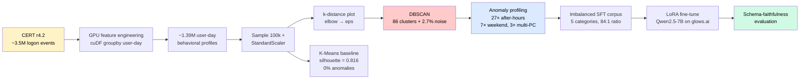
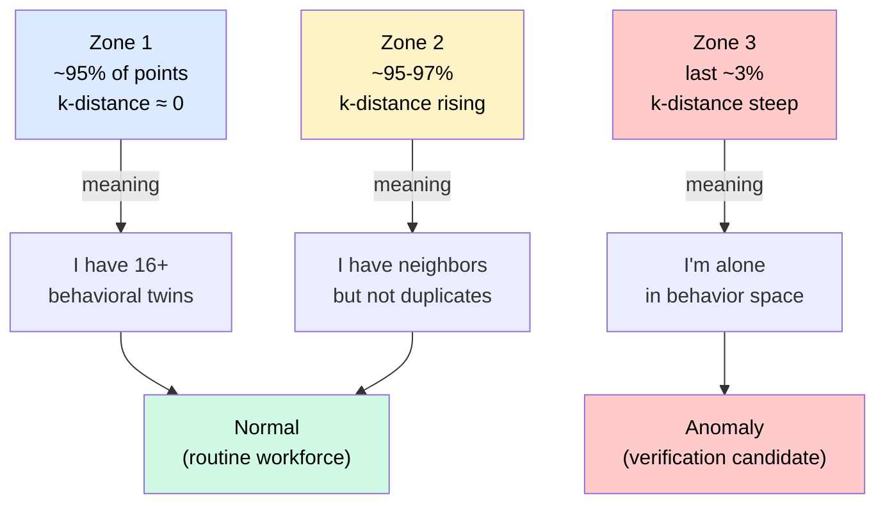
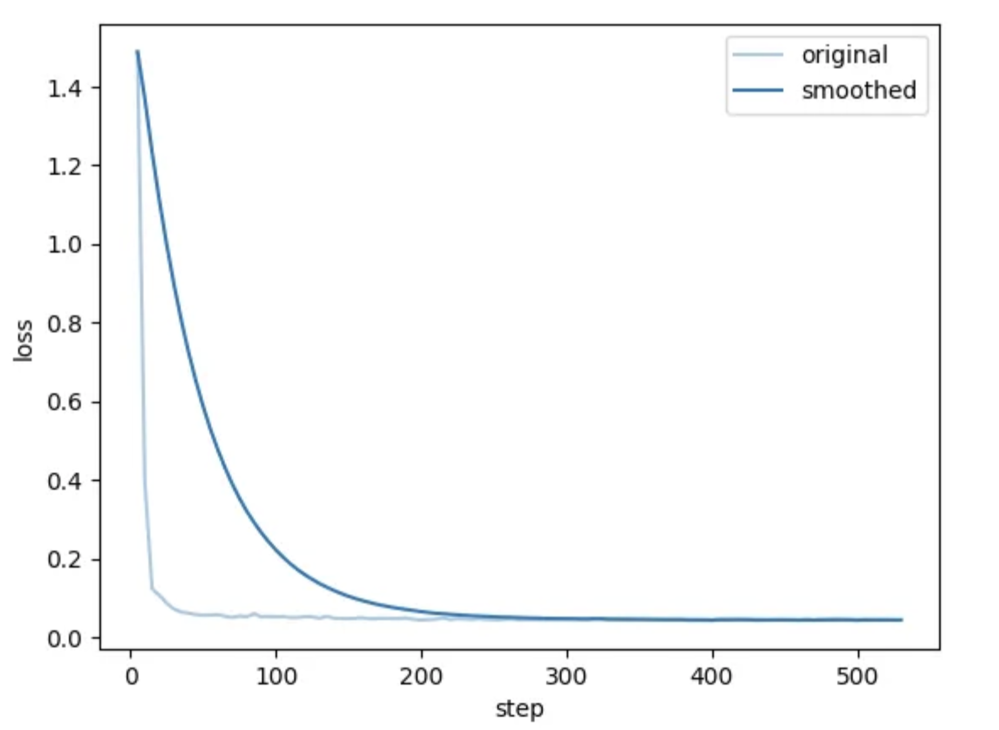

# 🛡️ trustless

**Behavioral baselines for Zero Trust Architecture, learned from data.**

 

A research-flavored exploration of **density-based behavioral clustering** as the trust signal for [Zero Trust Architecture (NIST SP 800-207)](https://csrc.nist.gov/pubs/sp/800/207/final), with a follow-on study on whether fine-tuned language models can faithfully serialize those signals into structured incident schemas.

 

## 🔭 What I'm exploring

Zero Trust Architecture (ZTA) — as defined in NIST SP 800-207 — replaces the perimeter with **per-session contextual evaluation**. Every access request is assessed by *who* is connecting, *from what device*, *when*, and *to what*. The Policy Decision Point makes a continuous trust judgment based on those signals.

But where do those signals come from? Static rules ("logon must be 8–10 AM") don't scale to a multi-modal workforce of office workers, night-shift admins, and remote staff. The honest answer is that trust signals must be **learned** from observed behavior — and learned without labels, because real telemetry doesn't come tagged with "suspicious."

This project is my exploration of that question, in two parts:

> **Part 1.** Can unsupervised clustering on raw user-day behavioral data produce a useful "flag for verification" signal — without labels, without rules?
>
> **Part 2.** Can a fine-tuned language model faithfully serialize those clustered events into a strict incident schema — and what happens when the rare categories that *most matter* in security are the ones with the fewest training examples?

I'm not solving production ZTA. I'm probing the seams between machine learning, security architecture, and language models — finding where the abstractions break and what that breakage teaches us.

> **A note on naming.** I use **ZTA** (Zero Trust Architecture) throughout, following NIST SP 800-207. ZTN/ZTNA usually refers more narrowly to network-layer implementations of zero trust. For a study about *behavioral baselines* — which span identity, device, and temporal context, not just network segments — ZTA is the right scope.

## 🗺️ Process at a glance

The two halves of the project share a single insight: **rare events in cybersecurity behavioral data are valuable for detection precisely because they are rare — and that same rarity is what makes them hard to learn.**

## 🧪 Part 1 — Behavioral baselines via DBSCAN

### Setup

- **Data:** [CERT Insider Threat r4.2](https://kilthub.cmu.edu/articles/dataset/Insider_Threat_Test_Dataset/12841247) `logon.csv` — 1,000 synthetic users, 17 months of activity
- **Aggregation:** raw events → one row per (user, day) with 8 behavioral features (counts, hour spans, after-hours flags, multi-PC indicators)
- **Sample:** 100,000 user-days for tractable DBSCAN on a T4
- **Hardware:** NVIDIA T4 + RAPIDS cuML/cuDF → ~3 sec total clustering time

### Why DBSCAN, not K-Means

The methodological argument is simple: ZTA needs **density semantics**, not partition semantics.

| Property | K-Means | DBSCAN |
|---|---|---|
| Cluster count | Required (`k`) | Discovered |
| Output for outliers | Forced into nearest cluster | Marked as `noise = -1` |
| Handles imbalance | Poorly | Natively |
| Output structure | Partition (every point assigned) | Density (some points are nowhere) |

DBSCAN is the only common clustering algorithm that explicitly says "this point doesn't belong to any cluster." That is **exactly** the output a Policy Decision Point needs — a discrete verification queue, not a partition.

### What the data looks like

The k-distance plot tells the whole story: 95% of user-days have at least 16 exact behavioral duplicates (the synthetic CERT workforce is highly repetitive), the next 2-3% are slight variations, and the final 2-3% are genuinely isolated. DBSCAN draws its threshold at the elbow (`eps = 0.872`, the 97th percentile) and flags Zone 3.

### Results

| Metric | Value |
|---|---:|
| DBSCAN clusters | **86** distinct behavioral patterns |
| DBSCAN noise (anomalies) | **2,658** (2.7%) |
| K-Means baseline silhouette | 0.816 |
| K-Means anomalies surfaced | **0** |
| `n_after_hours` ratio (anomaly / normal) | **27.27×** |
| `n_weekend` ratio | 7.40× |
| `n_distinct_pcs` ratio | 3.29× |

**The headline:** DBSCAN's 2,658 noise points show 27× more after-hours activity, 7× more weekend events, and 3× more distinct machines than normal user-days. K-Means with the best silhouette score absorbed every one of those anomalies into one of two giant partitions. The "better" metric optimized the wrong objective.

### What this taught me

The choice of clustering algorithm should be driven by **what the operational system needs to consume** — not by which algorithm produces the prettiest abstract metric. For ZTA, the needed output is a verification queue. Silhouette is operationally meaningless; noise count is everything.

## 🧬 Part 2 — Schema fidelity under data imbalance

The natural follow-up: take those clustered events and try to make a language model output them as structured ZTA incident schemas. This is where the surface of "ML for security" cracks open.

### Setup

- **Base model:** [Qwen2.5-7B-Instruct](https://huggingface.co/Qwen/Qwen2.5-7B-Instruct) (LLaMA-3 was access-gated, so I pivoted)
- **Method:** LoRA SFT on [LLaMA-Factory](https://github.com/hiyouga/LLaMA-Factory), rank=8, alpha=16, 3 epochs
- **Training corpus:** 3,000 synthetic (input, schema) pairs derived from Part 1's clusters
- **Hardware:** glows.ai container with GPU access

### The deliberately imbalanced corpus

| Category | Examples | % | Role |
|---|---:|---:|---|
| `NORMAL` | 2,100 | 70.0% | 🟢 Data-rich |
| `AFTER_HOURS` | 600 | 20.0% | 🟡 Medium |
| `MULTI_PC` | 200 | 6.7% | 🟠 Scarce |
| `WEEKEND_BURST` | 75 | 2.5% | 🔴 Very scarce |
| `EXTREME_LATE_NIGHT` | 25 | 0.8% | 🔴 Hallucination spotlight |

Imbalance ratio: **84:1** (NORMAL vs EXTREME_LATE_NIGHT).

This is **not** a flaw in the dataset — it's a faithful reproduction of real ZTA telemetry, where the events that matter most for security are the rarest by definition.

### Training dynamics

### Two rounds, one variable changed

I ran the SFT twice with identical configs. The only difference was the `instruction` text inside each training example:

- **Round 1:** "Output a ZTN incident schema as a JSON object with these fields…"
- **Round 2:** Same plus an explicit enum list inside the instruction itself: `risk_level: LOW | MEDIUM | HIGH | CRITICAL`, etc.

| Category | Examples | Round 1 (vague instruction) | Round 2 (explicit enums) |
|---|---:|---|---|
| NORMAL | 2,100 | 2/6 fields ❌ | **6/6** ✅ |
| AFTER_HOURS | 600 | 1/6 ❌ | **6/6** ✅ |
| MULTI_PC | 200 | 0/6 ❌ | 5/6 ⚠️ (category confused) |
| WEEKEND_BURST | 75 | 0/6 ❌ | 4/6 ⚠️ |
| EXTREME_LATE_NIGHT | 25 | 0/6 ❌ (invented `VERY_HIGH`) | 5/6 ⚠️ (fired CRITICAL + BLOCK_AND_ALERT, but mislabeled `anomaly_type`) |

### The interesting failure mode

Round 1 hallucinated *across all categories* — even data-rich NORMAL produced free-text values instead of the defined enums. The model fell back on its pre-training prior (natural language description) and ignored the closed vocabulary in 3,000 fine-tuning examples.

Round 2 fixed this by enumerating the allowed values inside every instruction. Schema compliance became near-perfect for data-rich categories. **But a residual failure mode persisted, specifically on the rarest categories** — and only in the field that requires distinguishing between named categories (`anomaly_type`). With 200 examples or fewer, the model collapsed scarce categories into the nearest high-frequency one.

### What this taught me

Two distinct failure modes, two distinct fixes:

> **Vocabulary failure** is solved by prompt engineering. Put the closed enum in the instruction, in every example.
>
> **Discrimination failure** between rare categories is **not** solved by prompt engineering. It's a data-distribution problem, and it shows precisely in the field that requires the model to discriminate between rare classes.

In production ZTA, this has a specific consequence: the model would correctly fire `BLOCK_AND_ALERT` on extreme cases (the action is right) but would mislabel the incident category in the SOC ticket (so the analyst applies the wrong remediation playbook). Even partial hallucination has downstream operational cost.

## 🔗 The thread connecting both parts

Part 1 made the clustering **work** by treating imbalance as a feature, not a bug — DBSCAN succeeds *because* anomalies are rare and isolated. Part 2 made the language model **fail** for the same reason — fine-tuning fails *because* anomalies are rare and unrepresented.

The asymmetry is the whole point: density-based methods turn rarity into signal; supervised learning turns rarity into hallucination. A real ZTA pipeline needs both — clustering to surface candidate incidents, structured serialization to pass them to enforcement — and the second half is harder than it looks.

## 📚 References

- Rose, S., Borchert, O., Mitchell, S., & Connelly, S. *Zero Trust Architecture*. NIST Special Publication 800-207, 2020. [csrc.nist.gov/pubs/sp/800/207/final](https://csrc.nist.gov/pubs/sp/800/207/final)
- Ester, M., Kriegel, H.-P., Sander, J., & Xu, X. *A Density-Based Algorithm for Discovering Clusters in Large Spatial Databases with Noise*. KDD-96. [paper](https://file.biolab.si/papers/1996-DBSCAN-KDD.pdf)
- McInnes, L., Healy, J., & Melville, J. *UMAP: Uniform Manifold Approximation and Projection for Dimension Reduction*. arXiv:1802.03426, 2018. [arxiv](https://arxiv.org/abs/1802.03426)
- Glasser, J., & Lindauer, B. *Bridging the Gap: A Pragmatic Approach to Generating Insider Threat Data*. IEEE SPW, 2013.
- Le, D. C., Zincir-Heywood, N., & Heywood, M. I. *Analyzing Data Granularity Levels for Insider Threat Detection Using Machine Learning*. IEEE TNSM, 2020.
- NVIDIA RAPIDS. *cuML — GPU-Accelerated Machine Learning*. [github.com/rapidsai/cuml](https://github.com/rapidsai/cuml)
- Llama-Factory. [github.com/hiyouga/LLaMA-Factory](https://github.com/hiyouga/LLaMA-Factory)

 

*A small project, kept honest about what worked and what didn't.*

