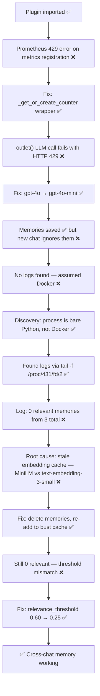

# 🐛 debug.md — Adaptive Memory v4 Setup & Debugging Journal
**Tags:** #openwebui #adaptive-memory #debugging #zero-trust #week8  
**Links:** [[Week 8 Planning]], [[Task 1 - Open WebUI Community Component]]

---

## 🎯 Elevator Pitch

> Getting Adaptive Memory v4 to actually work across new chats required fixing **four independent failure layers** in sequence — each one silent enough to look like the previous fix hadn't worked. This doc traces the full path from zero to working cross-chat memory.

---

## 🗺️ The Full Failure Chain (Overview)



---

## 📋 Stage 1 — Plugin Import & Prometheus Conflict

### What happened
Imported `adaptive_memory_v4.0.py` into Open WebUI Functions. Plugin activated but immediately threw:

```
Error: Duplicated timeseries in CollectorRegistry:
{'adaptive_memory_embedding_requests',
 'adaptive_memory_embedding_requests_created',
 'adaptive_memory_embedding_requests_total'}
```

### Root cause
The plugin registers Prometheus `Counter` and `Histogram` metrics at module load time. Open WebUI **re-imports the module on every request**, so metric names get registered twice into the global `CollectorRegistry`. Prometheus raises `ValueError` on duplicates.

The plugin had a fallback for when `prometheus_client` is **not installed** (dummy `_NoOpMetric`), but the package *was* installed — so the fallback never triggered and the real `Counter(...)` calls ran twice.

### Fix
Wrap every `Counter(...)` and `Histogram(...)` instantiation with try/except, and add `REGISTRY` to the import:

```python
from prometheus_client import Counter, Histogram, REGISTRY  # add REGISTRY

def _get_or_create_counter(name, description, labels=None):
    try:
        return Counter(name, description, labels or [])
    except ValueError:
        return REGISTRY._names_to_collectors[name]

def _get_or_create_histogram(name, description, labels=None):
    try:
        return Histogram(name, description, labels or [])
    except ValueError:
        return REGISTRY._names_to_collectors[name]
```

Replace all bare `Counter(...)` and `Histogram(...)` calls with these helpers:

```python
# Before
EMBEDDING_REQUESTS = Counter("adaptive_memory_embedding_requests_total", "...", ["provider"])

# After
EMBEDDING_REQUESTS = _get_or_create_counter("adaptive_memory_embedding_requests_total", "...", ["provider"])
```

### Lesson
`ImportError` fallbacks don't protect against **registration conflicts** — those are `ValueError`s that happen after a successful import.

---

## 📋 Stage 2 — Memory Extraction Silently Failing (HTTP 429)

### What happened
After fixing the Prometheus error, the plugin appeared to work — responses came through normally. But **Settings → Personalization → Memories** stayed empty after every message.

### Investigation
Enabled Memory (Experimental) in Settings → Personalization. Still empty. Configured LLM valves to point at OpenAI. Still empty.

### Finding the logs
First attempt used Docker commands:
```bash
docker logs open-webui   # → "docker: command not found"
```

Open WebUI was **not running in Docker** — it was a bare Python process installed via conda. Found it with:

```bash
ps aux | grep open-webui
# → PID 431: /root/miniconda3/envs/workenv/bin/python .../open-webui serve
```

Attached to live process output:
```bash
tail -f /proc/431/fd/1 /proc/431/fd/2 2>/dev/null
```

Sent a test message. Logs revealed:
```
WARNING - [AM v4.0.2] LLM API client error 429, not retrying
INFO    - [AM v4.0.2] Memory extraction: identified 0 potential memories
```

### Root cause
`llm_model_name` was set to `gpt-4o`. OpenAI rate-limited the extraction call (429) because `gpt-4o` has strict RPM limits, and the extraction call was competing with the main chat call on a low-tier API key.

### Fix
```
llm_model_name = gpt-4o-mini    # 30x cheaper, much higher rate limits
```

Memory extraction doesn't need a powerful model — it's JSON extraction from short conversational text. `gpt-4o-mini` is more than sufficient.

### Lesson
`outlet()` makes a **separate LLM API call** after every response. On rate-limited keys, this call loses to the main chat call and silently fails. Always use the cheapest capable model for memory extraction.

### Key command for live log monitoring (non-Docker)
```bash
# Find the PID first
ps aux | grep open-webui

# Then attach to its stdout/stderr
tail -f /proc/<PID>/fd/1 /proc/<PID>/fd/2 2>/dev/null
```

---

## 📋 Stage 3 — Memories Saved But New Chat Ignored Them

### What happened
After fixing the 429, memories appeared in **Settings → Personalization → Memories**:

```
[Tags: identity] User works as a security analyst at a fintech company in Taipei
[Tags: goal] User's main project is detecting prompt injection attacks  
[Tags: preference, behavior] User prefers Python over JavaScript
```

But opening a new chat and asking *"what is my job?"* returned *"I'm not sure what you're referring to"*. The model showed **"No memories saved."** status under every response.

### Investigation
Log showed:
```
INFO - [AM v4.0.2] Using cached embeddings for all 3 memories
INFO - [AM v4.0.2] Memory retrieval: found 0 relevant memories from 3 total memories
```

The plugin ran, found all 3 memories, computed similarity — but **0 passed the threshold**.

### Root cause: stale embedding cache (embedding space mismatch)

The memories were originally embedded using `all-MiniLM-L6-v2` (local model, the plugin default). Later the valves were changed to:
```
embedding_provider_type = openai_compatible
embedding_model_name    = text-embedding-3-small
embedding_api_url       = https://api.openai.com/v1/embeddings
```

The plugin cached the old MiniLM embeddings in SQLite. The `"Using cached embeddings"` log line confirmed it was reading from cache — never recomputing.

When a new query arrived, the query was embedded with **OpenAI `text-embedding-3-small`** (a different vector space), but the stored memories were still in **MiniLM space**. Cosine similarity between vectors from different embedding spaces is meaningless — scores came out near zero, nothing passed the threshold.

### Fix
Delete all memories and re-add them to force fresh embedding computation:

1. Go to **Settings → Personalization → Memories**
2. Delete all entries
3. Open a new chat, re-state your context: *"I am a security analyst at a fintech company in Taipei working on Zero Trust PDP systems"*
4. Wait for response — check Memories panel for new entries embedded with `text-embedding-3-small`

### Lesson
**Embedding models are not interchangeable.** Vectors from different models live in incompatible spaces. If you change `embedding_model_name`, you must invalidate all cached embeddings — otherwise similarity scores are garbage. The plugin's TTL-based cache (`cache_ttl_seconds = 86400`) does not detect model changes.

---

## 📋 Stage 4 — Fresh Embeddings But Still 0 Relevant Memories

### What happened
After re-adding memories with fresh embeddings, the log changed slightly:
```
INFO - [AM v4.0.2] Memory retrieval: found 0 relevant memories from 3 total memories
```

No longer "using cached" — but still 0 relevant.

### Investigation
Examined the valve configuration:

```python
vector_similarity_threshold = 0.30   # initial filter — passes anything >= 0.30
relevance_threshold         = 0.60   # injection gate — must score >= 0.60 to inject
use_llm_for_relevance       = False  # vector score IS the final score
```

### Root cause: threshold mismatch

When `use_llm_for_relevance = False`, the pipeline is:

```
cosine similarity computed
        ↓
>= vector_similarity_threshold (0.30)?
        ↓ yes — passes initial filter
final relevance score = vector similarity score
        ↓
>= relevance_threshold (0.60) required to inject
        ↓ FAILS — score was e.g. 0.42, passes 0.30 but not 0.60
"0 relevant memories"
```

A memory scoring 0.42 similarity passed the vector filter but was then **rejected at injection** because `relevance_threshold` was still at its default 0.60 — never updated when the other thresholds were lowered.

### Fix
Make `relevance_threshold` lower than `vector_similarity_threshold`:

```python
relevance_threshold         = 0.25   # must be LOWER than vector_similarity_threshold
vector_similarity_threshold = 0.30   # initial filter
```

Also corrected the timezone:
```python
timezone = "Asia/Taipei"   # was "Asia/Dubai"
```

### Lesson
When `use_llm_for_relevance = False`, **`relevance_threshold` is the only injection gate**. It must be lower than or equal to `vector_similarity_threshold`, otherwise the two-stage filter creates an impossible condition: pass stage 1, fail stage 2, inject nothing, log "0 relevant memories" — with no warning that the configuration is self-defeating.

---

## ✅ Final Working Configuration

```python
# Embedding (OpenAI)
embedding_source            = "plugin"
embedding_provider_type     = "openai_compatible"
embedding_model_name        = "text-embedding-3-small"
embedding_api_url           = "https://api.openai.com/v1/embeddings"
embedding_api_key           = "<your-key>"

# LLM extraction (OpenAI — cheap model)
llm_provider_type           = "openai_compatible"
llm_model_name              = "gpt-4o-mini"
llm_api_endpoint_url        = "https://api.openai.com/v1/chat/completions"
llm_api_key                 = "<your-key>"

# Thresholds (consistent, non-contradicting)
vector_similarity_threshold = 0.30
relevance_threshold         = 0.25   # LOWER than vector threshold
memory_threshold            = 0.10
use_llm_for_relevance       = False

# Display
show_status                 = True
show_memories               = True
timezone                    = "Asia/Taipei"
```

---

## 🔍 Diagnostic Cheat Sheet

| Symptom | Log signature | Root cause | Fix |
|---|---|---|---|
| Plugin error on import | `Duplicated timeseries in CollectorRegistry` | Prometheus re-registration on module reload | Wrap `Counter()`/`Histogram()` in try/except `ValueError` |
| No memories saved | `LLM API client error 429` | Rate limit on extraction model | Switch to `gpt-4o-mini` |
| No memories saved | Complete silence, no AM logs | Function not assigned to model | Enable filter in Workspace → Models → Edit |
| Memories exist but new chat ignores | `Using cached embeddings` + `0 relevant` | Stale cache from old embedding model | Delete memories, re-add to force recompute |
| Memories exist, fresh embeddings, still 0 | `found 0 relevant memories from N total` | `relevance_threshold` > `vector_similarity_threshold` | Set `relevance_threshold` < `vector_similarity_threshold` |
| Can't find logs | `docker: command not found` | Not running in Docker | Use `tail -f /proc/<PID>/fd/2` |

---

## 💡 Deeper Insight: Why This Debug Was Hard

Every failure in this chain was **silent by design**. The plugin catches exceptions internally and logs at WARNING or INFO level — never ERROR. From the user's perspective, each stage looked identical: the chat worked, memories didn't appear.

This is a common pattern in middleware systems: the happy path (chat response delivered) masks the unhappy path (memory extraction failed). The only way to distinguish them was live log inspection — which itself required finding the process first, since the assumed Docker environment didn't exist.

The embedding cache mismatch is particularly subtle because it's a **semantic failure**, not a code failure. The code ran correctly. The math ran correctly. The numbers were just meaningless because the vectors came from incompatible spaces.

**The Zero Trust parallel:** this is exactly why Zero Trust PDPs need **explainable decisions with logged reasoning**. A system that silently fails open (or silently fails to inject context) is as dangerous as one that crashes visibly — arguably more so, because you don't know it's broken.

---

## ❓ Active Recall

- [ ] Why does `docker logs` fail when Open WebUI is installed via conda rather than Docker? What's the correct alternative?
- [ ] What is the `CollectorRegistry` conflict and why does it only happen on module reload, not first load?
- [ ] If `use_llm_for_relevance = False`, what is the effective injection pipeline? Draw it.
- [ ] Why does changing `embedding_model_name` invalidate all cached embeddings, and what symptom does a stale cache produce?
- [ ] What condition makes `relevance_threshold` and `vector_similarity_threshold` contradictory? Write the inequality that must hold.
- [ ] What single log line tells you the plugin is running but injection is failing?
