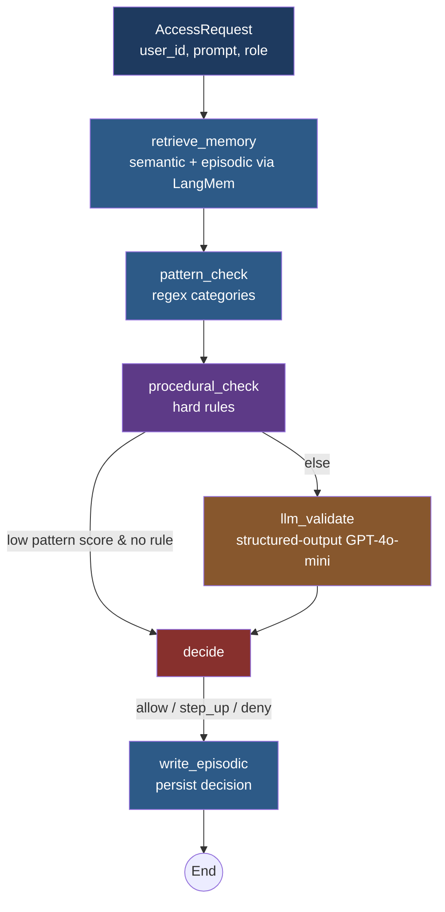

# Zero Trust PDP Agent

> A memory-aware Policy Decision Point built with LangGraph and LangMem. Combines deterministic pattern detection, hard procedural rules, and LLM-based semantic validation into a single auditable decision pipeline. Includes a structured harness that validates the agent's behaviour against multi-step adversarial scenarios.

**Week 8 Task 3 — Agentic Workflow + Harness Engineering**

---

## Why this exists

In NIST SP 800-207 Zero Trust Architecture, the **Policy Decision Point (PDP)** is the brain that decides whether to allow, deny, or require additional verification for any given access request. Real PDPs are **stateful and context-aware** — they cannot make decisions in isolation; they need:

1. **Who is the user?** (semantic memory — facts about the subject)
2. **What have they been doing?** (episodic memory — past decisions for this user)
3. **Does this request look risky on its own?** (pattern detection)
4. **Are there hard rules that override everything?** (procedural memory)
5. **Does the full picture suggest an attack?** (semantic LLM judgement)

This project implements all five layers as a LangGraph state machine, with each layer testable in isolation and composable into one end-to-end decision.

---

## Architecture



The conditional edge after `procedural_check` is a key cost optimization — when a procedural rule fires, or when the pattern score is so low that no LLM call could change the verdict, the graph short-circuits to `decide` and skips the LLM. This keeps median latency low while preserving full coverage on suspicious requests.

### Decision precedence

1. **Procedural rule violation → DENY** (overrides everything; the rule's reason is the decision's reason)
2. **Combined risk score ≥ deny_threshold → DENY**
3. **Combined risk score ≥ stepup_threshold → STEP-UP**
4. **Otherwise → ALLOW**

Combined risk score is `max(pattern_score, llm_score)` — we don't average because a high score from either layer is sufficient evidence; a missed signal in one shouldn't be diluted by the other.

---

## Project layout

```
zt_pdp_agent/
├── pyproject.toml          # uv-managed dependencies
├── .env.example            # all configuration knobs documented
├── README.md
├── src/zt_pdp/
│   ├── __init__.py
│   ├── config.py           # Settings dataclass loaded from .env
│   ├── schemas.py          # Pydantic data contracts (AccessRequest, PDPDecision, ...)
│   ├── patterns.py         # regex-based risk pre-filter
│   ├── procedural.py       # hard rules engine
│   ├── memory.py           # LangMem-backed long-term memory wrappers
│   ├── llm_validator.py    # structured-output LLM PEP validator
│   ├── nodes.py            # individual graph nodes
│   ├── agent.py            # LangGraph state machine
│   ├── harness.py          # multi-scenario test harness
│   └── cli.py              # interactive REPL for demos
├── scripts/
│   └── render_graph.py     # exports agent_graph.png for the report
├── tests/
│   ├── test_patterns.py    # pure unit tests, no LLM
│   ├── test_procedural.py
│   └── test_agent_offline.py  # graph integration with mocked LLM
└── docs/
    └── agent_graph.png     # generated by render_graph.py
```

---

## Setup

This project uses [`uv`](https://docs.astral.sh/uv/) for dependency management — fast, reproducible, lockfile-based.

### Install uv (if you don't have it)

```bash
curl -LsSf https://astral.sh/uv/install.sh | sh
```

### Clone and install

```bash
cd zt_pdp_agent
uv sync                 # installs all deps including dev extras
```

### Configure

```bash
cp .env.example .env
# Edit .env — set OPENAI_API_KEY at minimum
```

The `.env.example` documents every configurable knob. Defaults are sensible for development.

---

## Usage

### Run the harness (Task 3 main deliverable)

```bash
uv run zt-harness
```

This runs all seven scenarios against a fresh agent, prints a per-scenario table, and writes `harness_results.json` for record-keeping. Exit code is 0 on full pass, 1 on any failure — suitable for CI.

To run a subset of scenarios:

```bash
uv run zt-harness --scenarios S1-baseline-benign S3-slow-burn-escalation
```

### Interactive demo

```bash
uv run zt-cli --user demo-user
```

Drops you into a REPL where you can paste prompts and see the PDP decision in real time. Memory persists across prompts within the session, so you can demonstrate the slow-burn escalation interactively.

### Render the graph topology

```bash
uv run python scripts/render_graph.py
# → docs/agent_graph.png + docs/agent_graph.mmd
```

Use this PNG for the assignment screenshot showing the workflow.

### Run unit tests (no LLM required)

```bash
uv run pytest                # all tests
uv run pytest tests/test_patterns.py -v  # one file verbose
```

The agent integration tests in `test_agent_offline.py` mock the LLM call so they run instantly with no API cost.

---

## Harness scenarios

Each scenario is a sequence of `AccessRequest` objects with expected outcomes. Scenarios test specific architectural claims:

| ID | Tests | Architectural claim |
|----|-------|---------------------|
| S1-baseline-benign | 5 benign requests should all allow | The PDP doesn't false-positive on legitimate use |
| S2-injection-attack | Multi-pattern injection denied | Pattern detection catches obvious attacks |
| S3-slow-burn-escalation | 4-turn recon→escalation→exfiltration | LLM + episodic memory catch multi-turn attacks |
| S4-procedural-override | Intern requesting prod access | Procedural rules override LLM judgement |
| S5-memory-recall-repeat-offender | Repeat credential request | Episodic memory contributes to subsequent decisions |
| S6-memory-poisoning-defence | Poisoned semantic memory + destructive request | Procedural rule defends even when memory is compromised |
| S7-anonymous-credentials | Anonymous user requesting passwords | Procedural rule catches unauthenticated credential access |

Each scenario also has **invariants** — properties the entire sequence must satisfy beyond per-step expectations (e.g., risk score must monotonically increase across S3, episodic memory must be used in step 2 of S5).

---

## Configuration reference

All knobs are in `.env` (see `.env.example`). Highlights:

| Variable | Default | Purpose |
|---|---|---|
| `OPENAI_API_KEY` | — | Required |
| `ZT_PDP_LLM_MODEL` | `gpt-4o-mini` | Model for the PEP validator |
| `ZT_PDP_DENY_THRESHOLD` | `0.75` | Risk score that forces deny |
| `ZT_PDP_STEPUP_THRESHOLD` | `0.45` | Risk score that triggers step-up |
| `ZT_PDP_SESSION_WINDOW` | `8` | STM window size |
| `ZT_PDP_MEMORY_K` | `5` | Memories returned per semantic search |
| `ZT_PDP_LLM_VALIDATE_ALWAYS` | `false` | Force LLM call on every request (more thorough but slower) |

---

## Design principles

### 1. Use mature packages where they exist

`langmem` provides battle-tested memory tools. `langgraph` provides the state machine. `langchain-openai` provides structured outputs. We don't reinvent any of these — we compose them.

### 2. Each layer is independently testable

`patterns.scan()` is a pure function. `procedural.check()` is a pure function. `llm_validator.validate()` is mockable. The graph wires them together but each can be exercised in isolation. See `tests/` for examples.

### 3. The LLM has one job

The LLM doesn't decide allow/deny. That deterministic mapping happens in `nodes.decide()`. The LLM only produces a structured risk assessment with reasoning. This separation makes the system auditable: changing the deny threshold doesn't require re-prompting; changing the prompt doesn't risk decision drift.

### 4. Context engineering, not prompt stuffing

The LLM prompt is short and explicit (see `llm_validator._SYSTEM_PROMPT`). The user message is assembled from minimal, decision-relevant context — request, memories, pattern signals — in a clear order that prioritizes the LLM's attention on the question being asked. We do not pass the full conversation history.

### 5. Procedural rules are code, not prompts

Hard rules (interns can't access prod, anonymous can't request credentials) are deterministic Python predicates in `procedural.py`. They are reviewable, testable, and don't depend on LLM behaviour. This is the auditability layer of the policy.

---

## What this connects to

- **Task 1** — The Adaptive Memory plugin is the upstream PIP that feeds semantic facts. Its memory poisoning vulnerability is exactly what this agent's procedural rules and structured LLM validation defend against (see scenario S6).
- **Task 2** — The ZT PEP filter is the upstream enforcer that blocks requests in Open WebUI. Its pattern detection is reused here as `patterns.py`. Together, the filter is the PEP and this agent is the PDP.
- **Prior coursework** — The DBSCAN behavioural-cluster PIP from prior weeks would feed into `AccessRequest.behavioral_cluster`. The SFT'd LLaMA-Factory PDP model could replace `gpt-4o-mini` in `llm_validator.py` by changing the model string in `.env`.

---

## License

MIT
