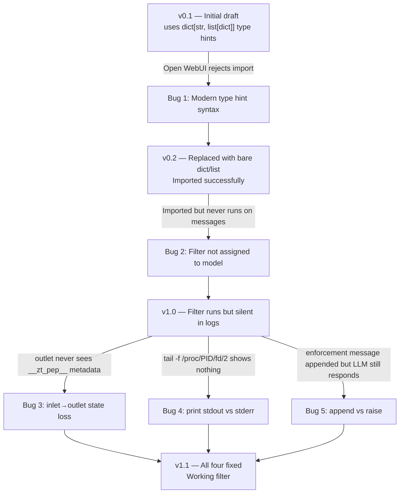
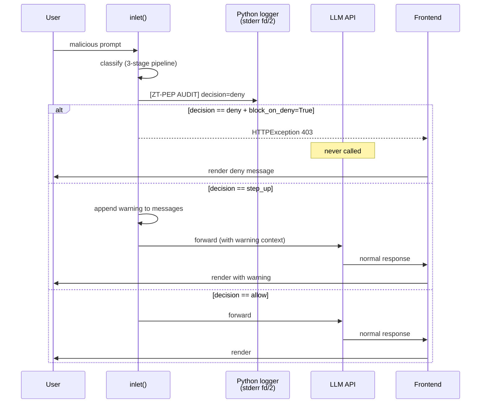

# 🔧 fix.md — ZT PEP Filter Iterative Bug Fixes
**Tags:** #openwebui #zero-trust #PEP #debugging #python #week8  
**Links:** [[Task 2 Guide]], [[debug.md]], [[zt_pep_filter.py]]

---

## 🎯 Elevator Pitch

> Building the custom Open WebUI filter required fixing **four distinct bugs** across two iterations. Each bug was silent in a different way: refused import, wouldn't run, ran but wrote logs nowhere, or ran but couldn't enforce. This document traces each failure, the root cause, and the fix.

---

## 🗺️ Bug Discovery Timeline



---

## 📋 Bug 1 — Modern type hint syntax broke import

### Symptom
After pasting the filter code into **Admin Panel → Functions → New Function** and clicking Save, Open WebUI's parser rejected the file. The function did not appear in the active functions list.

### Root cause
The original code used PEP 585 native generic type hints introduced in **Python 3.9+**:

```python
self._stm: dict[str, list[dict]] = {}                     # ← 3.9+ only
def _match_patterns(self, text: str, patterns: list[str]) -> list[str]:  # ← 3.9+ only
def _compute_base_risk(self, prompt: str) -> tuple[float, list[str]]:    # ← 3.9+ only
```

Open WebUI's function loader runs in a sandboxed parser that did not accept these as valid type expressions in this context — even though the host Python (3.11) supports them at runtime. The parser failed silently without surfacing a meaningful error.

### Fix
Removed the parameterized generics. Python's runtime behavior is identical without them; only the type checker loses precision:

```python
# Before
self._stm: dict[str, list[dict]] = {}
def _match_patterns(self, text: str, patterns: list[str]) -> list[str]:

# After
self._stm = {}
def _match_patterns(self, text, patterns):
```

Also dropped unused imports (`Literal`) to reduce parser surface area.

### Lesson
Open WebUI's function parser is stricter than CPython itself. Use only the most universally compatible Python syntax: bare `dict`/`list` for instance variables, untyped or `Optional[dict]` for parameters. Modern PEP 585 syntax is not safe.

---

## 📋 Bug 2 — Filter imported but never executed

### Symptom
After fixing the type hints, the file imported cleanly. Settings → Functions showed it as enabled. But sending chat messages produced **zero log output** from the filter — only Adaptive Memory logs appeared.

### Root cause
**Enabling a function globally is not the same as attaching it to a model.** Open WebUI has two separate enablement layers:

1. **Admin Panel → Functions** — toggles the function as available system-wide
2. **Workspace → Models → [model] → Edit → Filters** — toggles which functions actually run for that specific model

A function can be globally enabled but inactive on every model. This was the same root cause as the Adaptive Memory diagnosis earlier in the project, but it caught us a second time because it's not signposted clearly in the UI.

### Fix
1. Open **Workspace → Models → your custom model → Edit**
2. Scroll to the Filters section
3. Toggle **Zero Trust PEP Stateful Risk Filter** to active
4. Save

After this, sending a message immediately produced filter execution.

### Lesson
Open WebUI uses **two-stage activation** for functions: import + per-model attach. Always verify the per-model attachment after every import or code change.

---

## 📋 Bug 3 — `inlet()` to `outlet()` state was lost

### Symptom
After confirming the filter ran (verified by adding a temporary `print` at the top of `inlet()`), the `outlet()` audit logging block never produced output. The `if pep_meta:` check was always falsy.

### Root cause
The original design attached audit metadata to the request body in `inlet()`:

```python
async def inlet(self, body, user=None):
    ...
    body["__zt_pep__"] = {"decision": ..., "risk_score": ...}  # added to request
    return body

async def outlet(self, body, user=None):
    pep_meta = body.get("__zt_pep__", {})  # ← always empty
    if pep_meta:
        ...                                  # ← never reached
```

This was based on a faulty mental model of Open WebUI's filter pipeline. **`inlet()` and `outlet()` operate on different `body` payloads:**

- `inlet()` receives the **request payload** going to the LLM (contains `messages`, settings, etc.)
- `outlet()` receives the **response payload** coming back from the LLM (contains generated text, usage stats, etc.)

The custom `__zt_pep__` key added in `inlet()` is part of the request and never appears in the response. By the time `outlet()` runs, that data is gone.

### Fix
Move the audit logging directly into `inlet()`, immediately after the decision is computed. There's nothing `outlet()` can usefully do for this filter, so the `outlet()` method was removed entirely:

```python
async def inlet(self, body, user=None):
    ...
    decision = self._make_decision(total_risk)
    
    # Audit logging happens HERE, where the data is live
    audit = {"decision": decision, "risk_score": total_risk, ...}
    logger.info("[ZT-PEP AUDIT] {}".format(json.dumps(audit)))
    
    return body

# outlet() removed — there is no useful work for it to do
```

### Lesson
Filter `inlet()` and `outlet()` are not symmetric. They handle different payloads in different directions. Don't try to pass state between them via custom keys — log immediately where the decision is made.

---

## 📋 Bug 4 — `print()` output was invisible to log monitoring

### Symptom
Even after moving the audit logging into `inlet()`, running the live log monitor showed nothing from the filter:

```bash
tail -f /proc/431/fd/2 2>/dev/null | grep ZT-PEP
# (no output)
```

But Adaptive Memory's logs appeared in the same stream, so the monitoring command was correct.

### Root cause
**`print()` writes to stdout (file descriptor 1). The monitoring command was tailing fd/2 (stderr).**

```python
print("[ZT-PEP AUDIT] ...")   # → /proc/<PID>/fd/1 (stdout)
```

These are two completely separate streams. The Adaptive Memory plugin uses Python's `logging` module, which Open WebUI's loguru-based configuration routes through stderr — that's why those logs were visible. A bare `print()` bypasses the logging framework entirely.

### Fix
Switch from `print()` to a proper logger that follows the same naming convention as Adaptive Memory:

```python
# At module level
logger = logging.getLogger("openwebui.plugins.zt_pep")
logger.setLevel(logging.INFO)

# In inlet()
logger.info("[ZT-PEP AUDIT] {}".format(json.dumps(audit)))
```

The `openwebui.plugins.*` logger namespace inherits Open WebUI's existing handler configuration, which routes to stderr alongside the rest of the application's logs.

### Lesson
**Never use `print()` for plugin output in Open WebUI.** Always use `logging.getLogger("openwebui.plugins.<your_plugin>")`. The same fact about stdout/stderr also explains why some debugging tutorials suggest tailing **both** `/proc/<PID>/fd/1` and `/proc/<PID>/fd/2` — but the right fix is to route output correctly, not to widen the monitoring net.

---

## 📋 Bug 5 — Appending an assistant message did not block the LLM

### Symptom
With logging fixed, the audit line correctly showed `"decision": "deny"` for malicious prompts. However, the LLM **still responded** to the request. The deny message was appended to the chat, but immediately after, the model generated its own response to the original prompt — sometimes contradicting the deny message.

### Root cause
The naive enforcement code looked like this:

```python
if decision == "deny":
    body["messages"].append({
        "role": "assistant",
        "content": "🛑 Access denied..."
    })
    return body  # ← does NOT short-circuit; LLM still gets called
```

In Open WebUI's filter pipeline, modifying `body["messages"]` in `inlet()` only adds context to the conversation. It does **not** halt the request. The flow continues:

1. Filter appends "Access denied" to `messages`
2. Open WebUI sends the entire `messages` array (including the appended assistant message AND the original user message) to the LLM
3. The LLM, seeing a conversation that ends with a user prompt asking for something malicious, generates its normal response

This is a fundamental misunderstanding of what "filter enforcement" means in Open WebUI. A filter is *advisory* by default — the only way to make it *enforcement* is to raise an exception that propagates up and aborts the request.

### Fix
Use `HTTPException` to halt the request entirely:

```python
from fastapi import HTTPException

if decision == "deny":
    enforcement_msg = self._format_decision_message(...)
    raise HTTPException(status_code=403, detail=enforcement_msg)
```

When this exception is raised:
- The LLM is **never called** — there is no API request to OpenAI/Ollama
- Open WebUI returns the 403 response directly to the frontend
- The frontend renders the `detail` message as the model's response
- No tokens are consumed, no rate limit is touched, no chance of jailbreak

For step-up decisions, the soft `body["messages"].append()` approach is still correct — step-up means *"verify intent and continue"*, not *"halt"*. The user should be able to confirm and proceed, which requires the conversation to remain alive.

A `block_on_deny: bool` valve was added so both modes can be demonstrated for the assignment.

### Lesson
**Open WebUI filters are not blocking by default.** To implement a true PEP, you must `raise HTTPException` — modifying `body` only changes context. This is the difference between an advisory filter (warns the user) and an enforcement filter (blocks the request). Real Zero Trust requires the second behavior.

---

## ✅ Final Working Architecture



---

## 🔍 Quick-Reference Failure Map

| Symptom | Root cause | Fix |
|---|---|---|
| File rejected on import | Modern type hints `dict[...]`, `list[...]`, `tuple[...]` | Use bare `dict`, `list`, `tuple` |
| Filter never runs (no logs) | Not assigned to model in Workspace → Models | Toggle on per-model in Filters section |
| `outlet()` audit never fires | `body` differs between `inlet()` and `outlet()` | Move audit into `inlet()`, drop `outlet()` |
| Logs missing from `tail -f /proc/PID/fd/2` | `print()` goes to stdout, not stderr | Use `logging.getLogger("openwebui.plugins.X")` |
| LLM still responds despite "deny" | Appending to `body["messages"]` is advisory, not blocking | `raise HTTPException(status_code=403)` |
| Single-pattern match scores 0.50 → step_up not deny | `deny_threshold = 0.75` requires multi-pattern attacks | Lower threshold or test with 3-category attacks |

---

## 💡 Deeper Insight: All Five Bugs Were "Silent" in Different Ways

What ties these bugs together isn't a single coding error — it's that **each one failed silently with a different signature**, requiring a different diagnostic technique:

| Bug | Failure mode | How it was detected |
|---|---|---|
| 1 (type hints) | Silent import rejection | UI didn't show the function in the list |
| 2 (model attach) | Silent inactivity | Logs from other plugins appeared, ours didn't |
| 3 (state loss) | Silent control-flow skip | Code ran but `if pep_meta:` was always False |
| 4 (stdout) | Silent stream mismatch | Logs existed but in a stream we weren't watching |
| 5 (advisory mode) | Silent override | Decision logged correctly but LLM ignored it |

This is the recurring theme of working with middleware: **the system stays quiet about disagreement.** A function fails to import, but the chat still works. A filter never runs, but messages still get answered. A blocker doesn't block, but it logs that it tried. The only way to debug this is to verify each layer independently, not trust any single observable signal.

The Zero Trust connection is direct: this is exactly the failure mode a real PDP must avoid. A PDP that *thinks* it denied a request but the underlying system never enforced the denial is worse than a PDP that obviously errored — because the auditor trusts the log, not the actual outcome.

---

## ❓ Active Recall

- [ ] What is the difference between Open WebUI's `inlet()` and `outlet()` `body` payloads, and what does that imply about state passing?
- [ ] Why does `print()` not appear in `tail -f /proc/<PID>/fd/2`? Where does it appear instead?
- [ ] What's the difference between modifying `body["messages"]` and raising `HTTPException` for filter enforcement?
- [ ] What two enablement steps are required to actually run a filter on a specific model?
- [ ] Which Python version introduced `dict[str, ...]` as native syntax, and why does Open WebUI's parser still reject it?
- [ ] If a deny message is appended to the conversation but the LLM still responds, what threat does this create that a true 403 block prevents?
